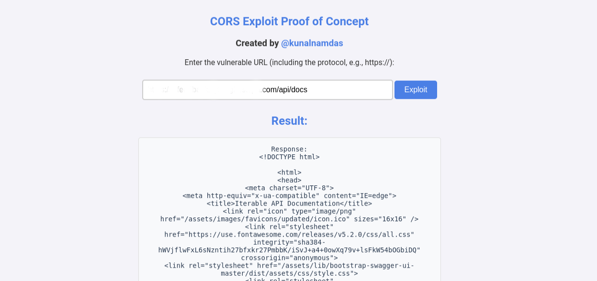

# CORSExploit-POC

This repository contains a Proof of Concept (PoC) tool designed to demonstrate CORS (Cross-Origin Resource Sharing) misconfigurations. It allows users to exploit vulnerable endpoints by sending cross-origin requests and retrieving sensitive information when the `Access-Control-Allow-Origin` is improperly configured. The tool is designed for ethical hacking and security research purposes. Always ensure you have proper authorization before testing any system.

## Features
- Exploits CORS misconfigurations
- Sends cross-origin requests with credentials
- Fetches and displays responses from vulnerable URLs
- Easy-to-use interface with no external dependencies




## How It Works
This tool demonstrates how misconfigured CORS policies can be exploited to access sensitive information from a vulnerable site by making cross-origin requests. The exploit uses JavaScript's `XMLHttpRequest` to send requests while including the victim’s cookies.

### Example Attack Flow:
1. Victim visits an attacker-controlled website.
2. The attacker’s website uses this tool to send a cross-origin request to a vulnerable domain.
3. If the target domain has a CORS misconfiguration, it responds with sensitive data.
4. The attacker is able to retrieve and view the response.

## Usage

1. **Clone the repository:**
    ```bash
    git clone https://github.com/kunalnamdas/CORSExploit-POC.git
    ```
2. **Host the HTML file:**
   - You can use GitHub Pages or a local web server to host the `exploit.html` file.

3. **Visit the hosted page:**
   - Open your hosted page in a browser and enter the URL of the vulnerable site in the input field.
   
4. **Click 'Exploit':**
   - The tool will send a request to the target URL with credentials and display the response.

## Disclaimer

This tool is for educational and ethical hacking purposes only. **Always ensure you have authorization** before testing any system or application. Misuse of this tool may lead to legal consequences.

## Author

Created by [@kunalnamdas](https://www.linkedin.com/in/kunalnamdas)

## License

This project is licensed under the MIT License - see the [LICENSE](LICENSE) file for details.
